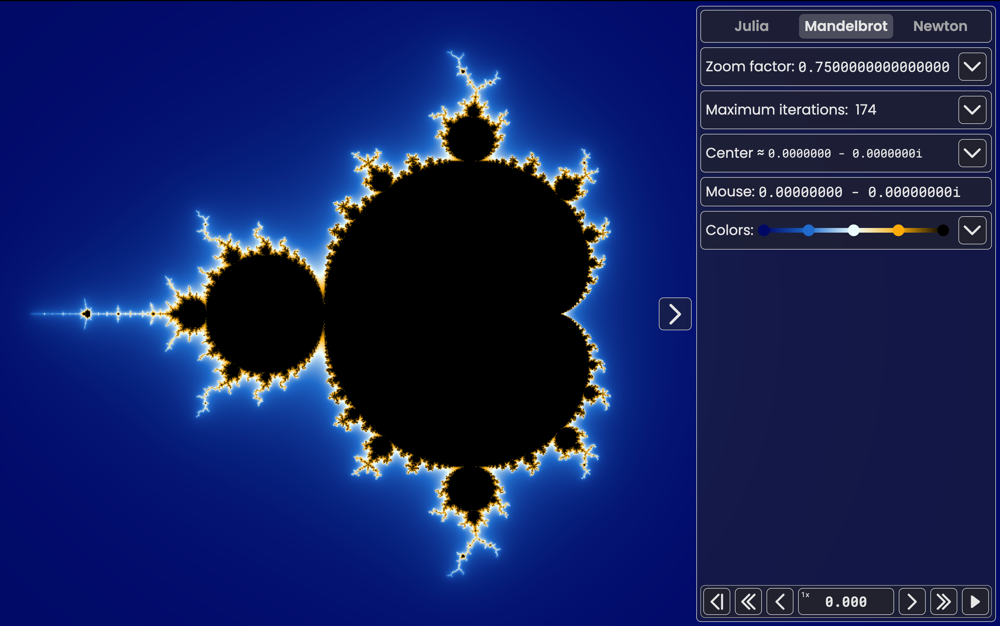

<!-- Improved compatibility of back to top link: See: https://github.com/othneildrew/Best-README-Template/pull/73 -->

<!--
*** Thanks for checking out the Best-README-Template. If you have a suggestion
*** that would make this better, please fork the repo and create a pull request
*** or simply open an issue with the tag "enhancement".
*** Don't forget to give the project a star!
*** Thanks again! Now go create something AMAZING! :D
-->

<!-- PROJECT SHIELDS -->

    
    
    
    

<!-- PROJECT LOGO -->
 

  

  <h3 align="center">Leottaro's fractal explorer</h3>

  

    A real time online fractal explorer to explore the Julia, Mandelbrot and Newton's fractals.
     
     
    <a href="https://leottaro.github.io/fractal-explorer">Try it</a>
    ·
    <a href="https://github.com/leottaro/fractal-explorer/issues/new?labels=bug">Report Bug</a>
    ·
    <a href="https://github.com/leottaro/fractal-explorer/issues/new?labels=enhancement">Request Feature</a>
     
    <a href="https://github.com/othneildrew/Best-README-Template">Template used</a>
  

<!-- TABLE OF CONTENTS -->

  
Table of Contents

  <ol>
    <li>
      <a href="#about">About The Project</a>
      <ul>
        <li><a href="#built">Built With</a></li>
      </ul>
    </li>
    <li><a href="#webgpu">webGPU</a></li>
    <li><a href="#roadmap">Roadmap</a></li>
    <li><a href="#contributing">Contributing</a></li>
    <li><a href="#contact">Contact</a></li>
  </ol>

<!-- ABOUT THE PROJECT -->

## ❓ About The Project

There are many great fractals explorers avaliable on the net. However most of them are either CPU based or offline. I wanted to make one avaliable online for most people. It has the most important features for a simple exploration. It currently allows you tu explore the Julia and Mandelbrot sets.

### 🔨 Built With

-   
-   
-   
-   
<!-- -   [][https://www.khronos.org/webgl/wiki/Main_Page] -->

<!-- GETTING STARTED -->

## ⚠️ webGPU

If your device or browser isn't compatible with webGPU, the website WILL not work. To know if webGPU is compatible with you see the [caniuse page](https://caniuse.com/?search=webgpu) or just test with the [official test website](https://toji.github.io/webgpu-test/).

<!-- ROADMAP -->

## 🧭 Roadmap

-   [x] Julia
-   [x] Mandelbrot
-   [ ] Newton
-   [x] Settings
    -   [x] Zoom
    -   [x] Maximum iterations
        -   [x] Automatic
        -   [x] Manual
    -   [x] Color gradient
        -   [x] Smooth colors
        -   [x] colors offset
            -   [x] time animated
    -   [x] Time control
        -   [x] Reset
        -   [x] forward / backward step
        -   [x] fast forward / backward
        -   [x] play/pause
-   [ ] Record system

See the [open issues](https://github.com/leottaro/fractal-explorer/issues) for a full list of proposed features (and known issues).

<!-- CONTRIBUTING -->

## 🪶 Contributing

Contributions are what make the open source community such an amazing place to learn, inspire, and create. Any contributions you make are **greatly appreciated**.

If you have a suggestion that would make this better, please fork the repo and create a pull request. You can also simply open an issue with the tag "enhancement".
Don't forget to give the project a star! Thanks again!

1. Fork the Project
2. Create your Feature Branch (`git checkout -b feature/AmazingFeature`)
3. Commit your Changes (`git commit -m 'Add some AmazingFeature'`)
4. Push to the Branch (`git push origin feature/AmazingFeature`)
5. Open a Pull Request

<!-- CONTACT -->

## Contact

Mail: leo.hafdane@gmail.com

Project Link: [https://github.com/leottaro/fractal-explorer](https://github.com/leottaro/fractal-explorer)
